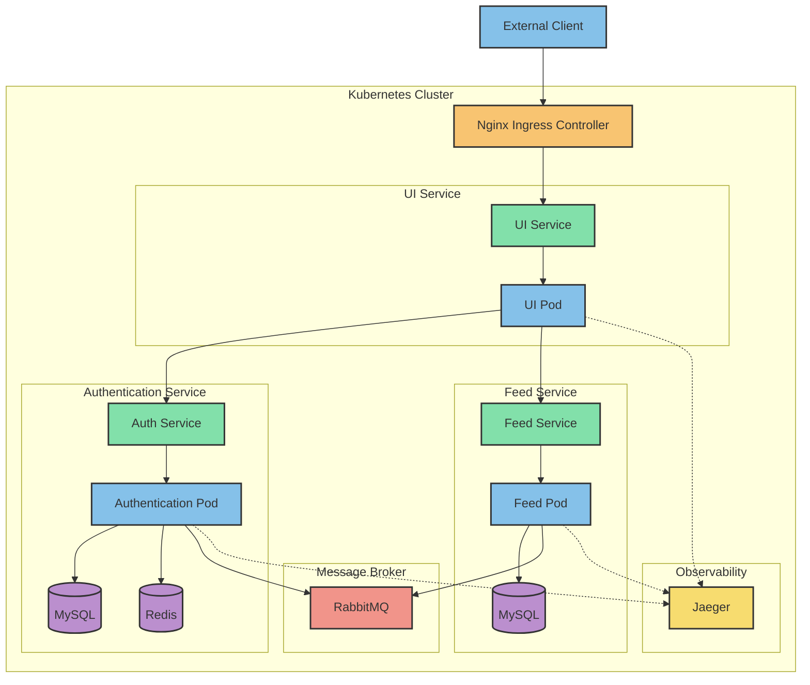
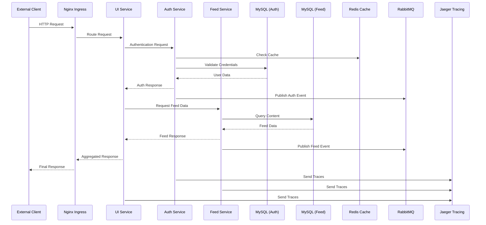

# ProSphere

## Project Overview
A modern microservices-based application consisting of three main services: Authentication, Feed, and UI, designed to demonstrate scalable and maintainable microservices architecture.

## System Architecture

### Sequence Diagram

## Architecture Overview

### 1. Authentication Service (Port: 4001, 8001)
- **Purpose**: Handles user authentication and authorization
- **Features**:
  - User registration and login
  - JWT token management
  - OAuth2 integration
  - Password encryption and management
- **Tech Stack**:
  - NestJS (Backend)
  - MySQL (Database)
  - Redis (Caching)
  - JWT (Authentication)
  - RabbitMQ (Message Queue)

### 2. Feed Service (Port: 4002, 8002)
- **Purpose**: Manages content feeds and user interactions
- **Features**:
  - Content aggregation and delivery
  - Real-time feed updates
  - User interaction tracking
  - Personalized content delivery
- **Tech Stack**:
  - NestJS
  - MySQL
  - RabbitMQ
  - Redis

### 3. UI Service (Port: 4003)
- **Purpose**: Frontend application
- **Features**:
  - Responsive design
  - Module federation
  - Real-time updates
  - Integrated authentication
- **Tech Stack**:
  - React.js
  - Module Federation
  - Webpack

## Prerequisites
- Docker and Docker Compose
- Node.js (v20+)
- npm or yarn
- Git

## Getting Started

### 1. Clone the Repository
```bash
cd example-microservices
```

```bash
$ docker-compose up -d
```

