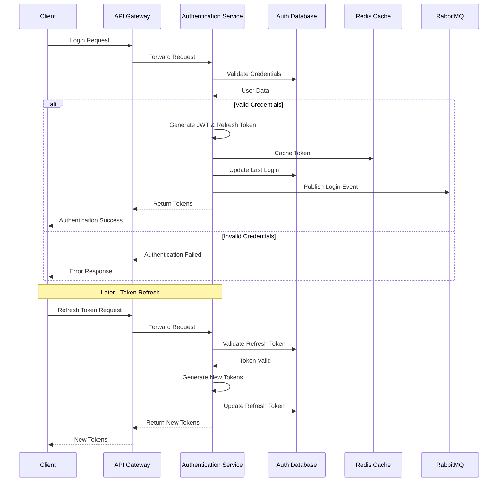

# Authentication Service

## Overview

The Authentication Service is a microservice component of the Example Microservices application. It handles user authentication, authorization, and user management functionality.

## Features

- User registration and management
- Authentication with JWT
- Refresh token mechanism
- Role-based access control
- Secure password hashing with bcrypt
- Integration with other services via RabbitMQ

## Architecture

The Authentication Service follows a microservice architecture pattern, communicating with other services through message queues and RESTful APIs.

### Authentication Flow

## Tech Stack

- NestJS framework
- TypeORM for database interactions
- MySQL database
- RabbitMQ for inter-service communication
- Redis for caching
- Docker for containerization
- Swagger for API documentation

## Prerequisites

- Docker and Docker Compose
- Node.js (for local development)
- npm or yarn

## Environment Variables

The service uses the following environment variables: