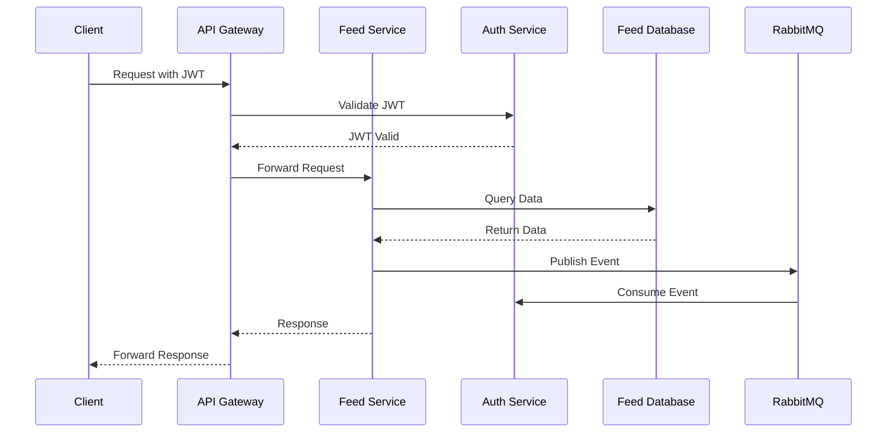

# Feed Service

## Overview

The Feed Service is a microservice component of the Example Microservices application. It handles social feed functionality including posts, comments, likes, connections between users, and media attachments.

## Features

- Post creation and management
- Comment functionality
- Like system
- User connections/relationships
- Media attachments for posts
- Feed generation based on user connections

## Architecture

The Feed Service follows a microservice architecture pattern, communicating with other services through message queues and RESTful APIs.

### System Architecture

## Tech Stack

- NestJS framework
- TypeORM for database interactions
- MySQL database
- RabbitMQ for inter-service communication
- Redis for caching
- Docker for containerization
- Swagger for API documentation

## Prerequisites

- Docker and Docker Compose
- Node.js (for local development)
- npm or yarn

## Environment Variables

The service uses the following environment variables:
